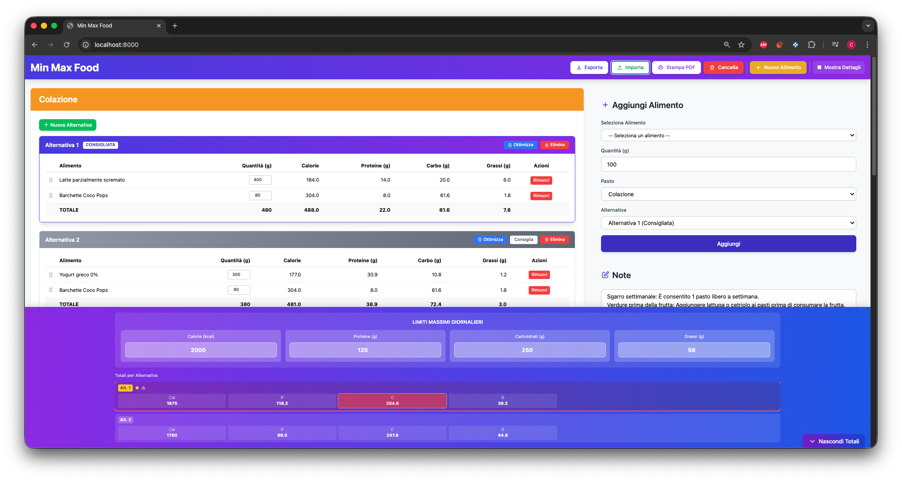

# Min Max Food




A web application for organizing daily meal plans with automatic calculation of nutritional values, alternative management, and macronutrient optimization using the **Minimum Cost Flow problem**.

## Features

The web application includes several features:

- **Alternative Management**: Create multiple variants for each meal with the same nutritional base
- **Automatic Optimization**: Optimization algorithm to approach set limits
- **Dynamic Calculation**: Automatic macro calculation based on grams entered
- **Custom Limits**: Set maximum limits for calories, protein, carbohydrates, and fats
- **Notes**: Add annotations and observations to the meal plan
- **JSON Export/Import**: Save and load complete plans with limits and notes
- **PDF Print**: Generate professional PDF with all alternatives and totals
- **Drag & Drop**: Reorder foods by dragging them

## Project Structure

```
ProjectMinMaxFood/
├── index.php              # Main page
├── assets/
│   ├── js/
│   │   └── app.js        # Application logic
│   └── css/
│       └── style.css     # Custom styles
├── config/
│   └── config.php        # Database configuration
├── includes/
│   ├── api.php           # Food retrieval API
│   └── add_food.php      # Food addition API
├── sql/
│   └── database.sql      # Database schema and initial data
├── docs/
│   └── img/              # Documentation images
└── README.md             # Documentation
```

## Installation

### 1. Configure the Database

Import the `sql/database.sql` file into your MySQL:

```bash
mysql -u root -p < sql/database.sql
```

Or via phpMyAdmin:
1. Open phpMyAdmin
2. Create a new database called `piano_alimentare`
3. Import the `sql/database.sql` file

### 2. Configure Database Connection

Edit the `config/config.php` file with your MySQL credentials:

```php
define('DB_HOST', 'localhost');
define('DB_USER', 'root');
define('DB_PASS', 'your_password');
define('DB_NAME', 'piano_alimentare');
```

### 3. Start the Server

#### Option A: PHP Built-in Server (for development)

```bash
cd /path/to/project
php -S localhost:8000
```

Then open your browser at: `http://localhost:8000`

#### Option B: XAMPP/WAMP/MAMP

1. Copy the project folder to `htdocs` (XAMPP) or `www` (WAMP)
2. Start Apache and MySQL
3. Open: `http://localhost/ProjectMinMaxFood`

#### Option C: Apache/Nginx Server

Configure the virtual host to point to the project directory.

## Usage

### Adding Foods to the Plan

1. **Select a food** from the dropdown menu (organized by categories)
2. **Enter the quantity** in grams (default: 100g)
3. **Choose the meal** (Breakfast, Lunch, Dinner, Snacks)
4. **Select the alternative** to add it to
5. Click **"Add"**

Nutritional values are automatically calculated based on the quantity entered.

### Managing Alternatives

- Click **"New Alternative"** to create a new meal variant
- Click **"Recommend"** to set an alternative as recommended
- Click **"Delete"** to remove an alternative
- Click **"Optimize"** to automatically adjust quantities to approach limits

### Viewing Totals

- **Per-meal totals**: Displayed at the bottom of each meal section
- **Daily totals**: Displayed in the bottom bar (can be shown/hidden with the button)

### Removing Foods

Click the **"Remove"** button next to the food you want to delete.

### Exporting the Plan

1. Click **"Export Plan (JSON)"**
2. The JSON file will be automatically downloaded with the name `piano-alimentare-YYYY-MM-DD.json`

### Importing a Plan

1. Click **"Import Plan (JSON)"**
2. Select a previously exported JSON file
3. Confirm if you want to overwrite the current plan

### Clearing Everything

Click **"Clear All"** to remove all foods from all meals.

## Database

### Table: alimenti

| Field        | Type         | Description                     |
|--------------|--------------|--------------------------------|
| id           | INT          | Unique ID                      |
| nome         | VARCHAR(100) | Food name                      |
| calorie      | DECIMAL(6,2) | Calories per 100g              |
| proteine     | DECIMAL(6,2) | Protein in grams per 100g      |
| carboidrati  | DECIMAL(6,2) | Carbohydrates in grams per 100g|
| grassi       | DECIMAL(6,2) | Fats in grams per 100g         |
| fibre        | DECIMAL(6,2) | Fiber in grams per 100g        |
| zuccheri     | DECIMAL(6,2) | Sugars in grams per 100g       |
| categoria    | VARCHAR(50)  | Food category                  |
| created_at   | TIMESTAMP    | Creation date                  |

The database includes over 50 common Italian foods, divided into categories:
- Cereals
- Meat
- Fish
- Dairy
- Eggs
- Legumes
- Nuts
- Fruit
- Vegetables
- Condiments

## Adding New Foods

To add new foods to the database:

```sql
INSERT INTO alimenti (nome, calorie, proteine, carboidrati, grassi, fibre, zuccheri, categoria)
VALUES ('Food Name', 100.0, 10.0, 20.0, 5.0, 2.0, 1.0, 'Category');
```

Foods can also be added through the web application's graphical interface.

## Important Notes

- Meal plans are **NOT saved in the database**
- Only foods are stored in the database
- Plans can be saved locally via JSON export
- All calculations happen client-side in real-time
